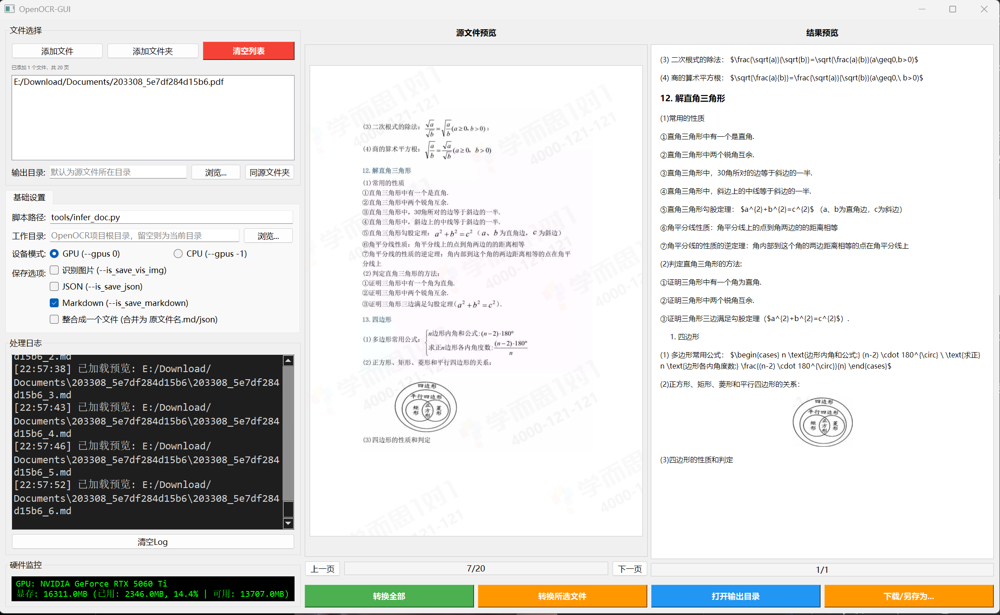
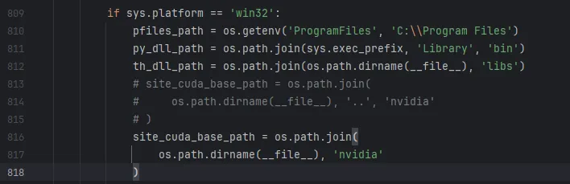
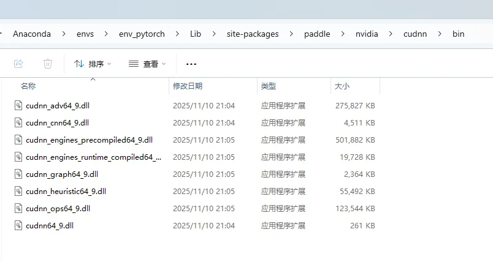

# OpenOCR-GUI




https://github.com/Topdu/OpenOCR 的分支，OpenOCR 文档识别转换工具的图形化界面程序，支持批量处理 PDF 文件和图片，将其转换为 Markdown、JSON 以及可视化识别结果。

原本OpenOCR是我用过的所有OCR中效果最好的（用过热门的10几个ocr项目了）所以做了这个GUI，介绍见https://github.com/Topdu/OpenOCR/blob/main/README_ch.md

模型下载：https://www.modelscope.cn/models/topdktu/unirec-0.1b/files

更新一个MD文件合并工具，万一没有勾选合并，可以使用这个md_merge_tool.py。

## 功能特点

- **多格式支持**：处理 PDF 文件和图片（PNG、JPG、JPEG）
- **批量处理**：可添加多个文件或整个文件夹进行批量转换
- **GPU 加速**：支持 GPU 加速模式（实时监控显卡状态）
- **多种输出格式**：
  - Markdown (.md) - 完整文档文本，保留格式
  - JSON (.json) - 结构化数据输出
  - 图片 (.png) - 可视化识别结果
- **文件合并**：可将多页文档合并为单一输出文件
- **实时预览**：
  - 源文件预览，支持翻页导航
  - Markdown 渲染结果实时预览
- **硬件监控**：实时显示 GPU 显存和使用情况
- **处理日志**：详细记录转换过程，含时间戳


## 安装说明

### 1. 环境准备

建议使用conda新建环境：

```bash
conda create -n openocr python=3.10
conda activate openocr
```

### 2. 安装 OpenOCR

```bash
git clone https://github.com/yifenk03/OpenOCR-GUI.git
cd OpenOCR
pip install -r requirements.txt -i https://pypi.tuna.tsinghua.ed
#50系显卡必需cu129,40以及更老的cu126稳定一些
python -m pip install paddlepaddle-gpu==3.2.0 -i https://www.paddlepaddle.org.cn/packages/stable/cu129/  
python -m pip install paddlex==3.3.12 paddleocr==3.3.2
pip install torch==2.8.0 torchvision==0.23.0 torchaudio==2.8.0 --index-url https://download.pytorch.org/whl/cu129
pip install transformers==4.49.0
pip uninstall opencv-python
pip install pypdfium2
pip install opencv-contrib-python
```

### 3. 运行程序

```bash
python OpenOCR-GUI.py
```

## 依赖说明

| 包名 | 版本要求 | 说明 |
|------|----------|------|
| PyQt5 | >=5.15.0 | 图形界面框架 |
| PyQtWebEngine | >=5.15.0 | Markdown 预览渲染引擎 |
| PyMuPDF | >=1.18.0 | PDF 文件处理 |
| markdown | >=3.3.0 | Markdown 转 HTML 转换 |
| GPUtil | >=1.4.0 | GPU 监控（可选） |

## 使用指南

### 设置项说明

- **脚本路径**：OpenOCR 推理脚本的路径
- **工作目录**：OpenOCR 项目根目录
- **设备模式**：GPU（推荐）或 CPU
- **保存选项**：
  - 识别图片：保存可视化识别结果
  - JSON：保存结构化 JSON 数据
  - Markdown：保存 Markdown 文本
- **整合成一个文件**：将多页文档合并为单一文件

### 预览功能

- **源文件预览**：左侧面板显示原始文档页面
- **结果预览**：右侧面板显示渲染后的 Markdown（含图片）
- **翻页导航**：使用「上一页」「下一页」按钮浏览多页文档

## 启动脚本

  两个启动bat需按照你的路径修改后才能使用

## 常见问题

### GPU 未检测到

- 请确保已正确安装 NVIDIA 显卡驱动
- 安装 GPUtil：`pip install GPUtil`
- 如 GPU 监控失败，程序仍可正常运行，只是不会显示 GPU 状态

### PDF 预览异常

- 请确认 PyMuPDF 已正确安装：`pip install PyMuPDF`
- 较大的 PDF 文件可能需要稍等片刻加载

### 转换失败

- 确认 OpenOCR 脚本路径设置正确
- 确保 OpenOCR 工作目录包含所需依赖文件
- 查看处理日志获取详细错误信息

# 杀虫
* OSError: [WinError 127] 找不到指定的程序。 Error loading "**\Lib\site-packages\paddle..\nvidia\cudnn\bin\cudnn_cnn64_9.dll" or one of its dependencies.

  找不到文件是因为 torch 加载的 cudnn dll 和 Paddle 使用的 dll 冲突导致的。经过排查之后发现，Paddle 会优先使用 site-packages\paddle\nvidia\cudnn\bin 下的 dll ，而 torch 会使用 site-packages\torch\lib 下的 dll
  OSError: [WinError 127] 找不到指定的程序。 Error loading "C:\Users\Administrator\AppData\Local\Programs\Python\Python312\Lib\site-packages\paddle..\nvidia\cudnn\bin\cudnn_cnn64_9.dll" or one of its dependencies.

  你需要先手动修改paddle的__ init __ .py文件第813-817行


  另外你可能会发现在site-packages\paddle\路径下没有nvidia\，你可以手动创建路径并拷贝dll文件



## 相关项目

- [OpenOCR](https://github.com/Topdu/OpenOCR) - 开源文档识别工具

## 致谢

- 图形界面框架：[PyQt5](https://www.riverbankcomputing.com/software/pyqt/)
- PDF 处理：[PyMuPDF](https://pymupdf.readthedocs.io/)
- Markdown 渲染：[Python-Markdown](https://python-markdown.github.io/)
